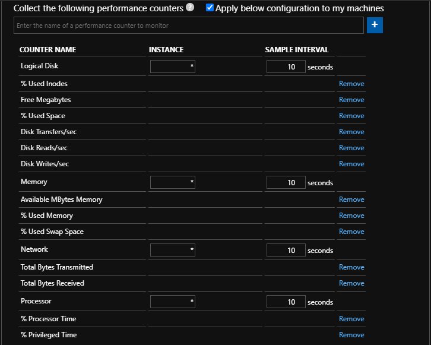
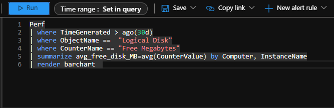

# Install Linux OMS Agent 

1. Install the Linux OMS Agent

        wget https://raw.githubusercontent.com/Microsoft/OMS-Agent-for-Linux/master/installer/scripts/onboard_agent.sh && sh onboard_agent.sh -w {workspace_id_here} -s {workspace_secret_here} -d opinsights.azure.com

2. Add Performance counters to workspace
    - Open Data Connectors
    - Browse to syslog
    - Open Connector
    - Click `Open your workspace advanced settings configuration`
    - Click `Data` > `Linux Performance Counters`
    - Add the following counters 

    

3. Wait for performance counters to be displayed in Azure Sentinel

    

4. Further KQL queries can be found [here](../kql/perf)