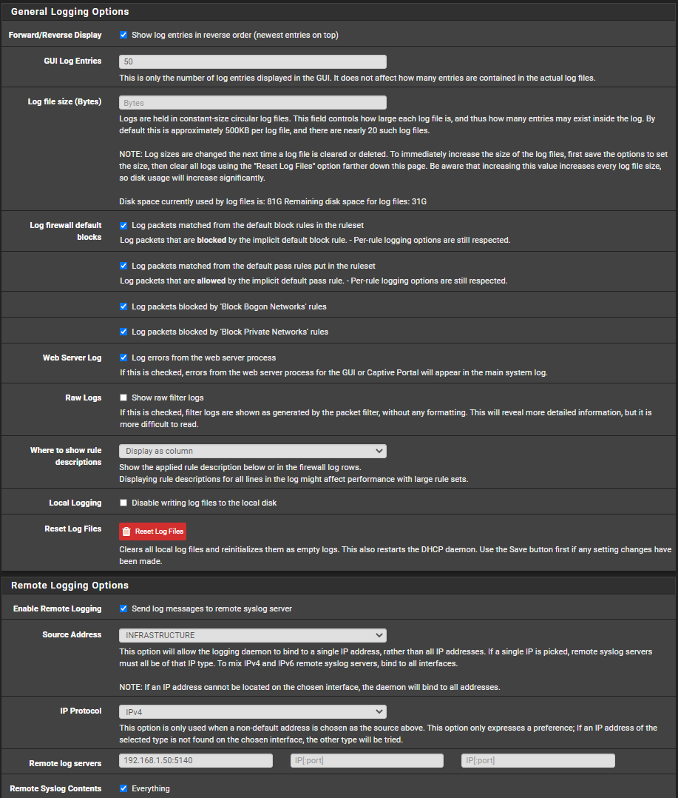
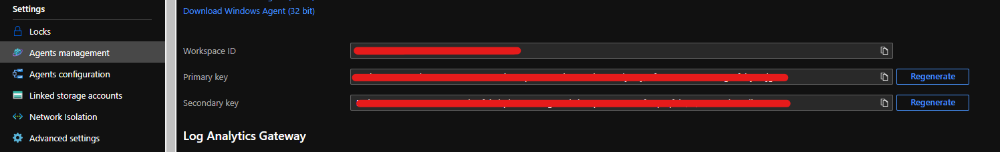
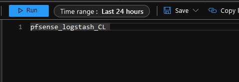

# pfSense/OPNsense > LogStash > Azure Sentinel

## Table of Contents

- [pfSense/OPNsense > LogStash > Azure Sentinel](#pfsenseopnsense--logstash--azure-sentinel)
  - [Table of Contents](#table-of-contents)
    - [Ubuntu (v18.04-v20.04+) Server onPrem](#ubuntu-v1804-v2004-server-onprem)
    - [Install MaxMind Database (Optional)](#install-maxmind-database-optional)
    - [Logstash Configuration](#logstash-configuration)
    - [Forwarding pfSense Logs to Logstash](#forwarding-pfsense-logs-to-logstash)
  - [Install and Configure the Log Analytics Plugin For Logstash](#install-and-configure-the-log-analytics-plugin-for-logstash)
  - [View pfSense Logs in Azure Sentinel](#view-pfsense-logs-in-azure-sentinel)
    - [Query logs in Azure Sentinel](#query-logs-in-azure-sentinel)

### Ubuntu (v18.04-v20.04+) Server onPrem
  
1. Install Ubuntu Server (v18.04-v20.04+) on a Virtual Machine or Computer and update the OS

    ```BASH
    sudo apt update; sudo apt upgrade -y
    ```

2. Disabling Swap - Swapping should be disabled for performance and stability. (optional)

    ```BASH
    sudo swapoff -a
    ```

3. Configuration Date/Time Zone

   - The box running this configuration will reports firewall logs based on its clock. The command below will set the timezone to Eastern Standard Time (EST).
   - To view available timezones type `sudo timedatectl list-timezones`

    ```BASH
    sudo timedatectl set-timezone Europe/London
    ```

4. Download and install the public GPG signing key

    ```BASH
    wget -qO - https://artifacts.elastic.co/GPG-KEY-elasticsearch | sudo apt-key add -
    ```

5. Download and install apt-transport-https package

    ```BASH
    sudo apt install apt-transport-https
    ```

6. Add LogstashRepositories (version 7+)

    ```BASH
    echo "deb https://artifacts.elastic.co/packages/7.x/apt stable main" | sudo tee -a /etc/apt/sources.list.d/elastic-7.x.list
    ```

7. Install Java 14 LTS

    ```bash
    sudo apt install openjdk-14-jre-headless
    ```

### Install MaxMind Database (Optional)

Maxmind isn't required for GeoIP lookups as this is also handled by Logstash by default.

1. Follow the steps [here](https://github.com/pfelk/pfelk/wiki/How-To:-MaxMind-via-GeoIP-with-pfELK), to install and utilise MaxMind. Otherwise the built-in GeoIP from Elastic will be utilised.

2. To leverage MaxMind, remove all instances of `#MMR#` in `/etc/logstash/conf.d/30-geoip.conf`.

Example:

```BASH
if "IP_Private_Source" not in [tags] {
  geoip {
    source => "[source][ip]"
    database => "/usr/share/GeoIP/GeoLite2-City.mmdb"
    target => "[source][geo]"
  }
```

### Logstash Configuration

1. Install Logstash

    ```BASH
    sudo apt update && sudo apt install logstash -y
    ```

2. Configuration
Create Required Directories

    ```BASH
    sudo mkdir /etc/logstash/conf.d/{databases,patterns,templates}
    ```

3. Download the following configuration files (Required)

    ```BASH
    sudo wget https://raw.githubusercontent.com/noodlemctwoodle/pfsense-azure-sentinel/main/Logstash-Configuration/etc/logstash/conf.d/01-inputs.conf -P /etc/logstash/conf.d/
    sudo wget https://raw.githubusercontent.com/noodlemctwoodle/pfsense-azure-sentinel/main/Logstash-Configuration/etc/logstash/conf.d/02-types.conf -P /etc/logstash/conf.d/
    sudo wget https://raw.githubusercontent.com/noodlemctwoodle/pfsense-azure-sentinel/main/Logstash-Configuration/etc/logstash/conf.d/03-filter.conf -P /etc/logstash/conf.d/
    sudo wget https://raw.githubusercontent.com/noodlemctwoodle/pfsense-azure-sentinel/main/Logstash-Configuration/etc/logstash/conf.d/05-apps.conf -P /etc/logstash/conf.d/
    sudo wget https://raw.githubusercontent.com/noodlemctwoodle/pfsense-azure-sentinel/main/Logstash-Configuration/etc/logstash/conf.d/20-interfaces.conf -P /etc/logstash/conf.d/
    sudo wget https://raw.githubusercontent.com/noodlemctwoodle/pfsense-azure-sentinel/main/Logstash-Configuration/etc/logstash/conf.d/30-geoip.conf -P /etc/logstash/conf.d/
    sudo wget https://raw.githubusercontent.com/noodlemctwoodle/pfsense-azure-sentinel/main/Logstash-Configuration/etc/logstash/conf.d/35-rules-desc.conf -P /etc/logstash/conf.d/
    sudo wget https://raw.githubusercontent.com/noodlemctwoodle/pfsense-azure-sentinel/main/Logstash-Configuration/etc/logstash/conf.d/37-enhanced_user_agent.conf -P /etc/logstash/conf.d/
    sudo wget https://raw.githubusercontent.com/noodlemctwoodle/pfsense-azure-sentinel/main/Logstash-Configuration/etc/logstash/conf.d/38-enhanced_url.conf -P /etc/logstash/conf.d/
    sudo wget https://raw.githubusercontent.com/noodlemctwoodle/pfsense-azure-sentinel/main/Logstash-Configuration/etc/logstash/conf.d/45-cleanup.conf -P /etc/logstash/conf.d/
    sudo wget https://raw.githubusercontent.com/noodlemctwoodle/pfsense-azure-sentinel/main/Logstash-Configuration/etc/logstash/conf.d/49-enhanced_private.conf -P /etc/logstash/conf.d/
    sudo wget https://raw.githubusercontent.com/noodlemctwoodle/pfsense-azure-sentinel/main/Logstash-Configuration/etc/logstash/conf.d/50-outputs.conf -P /etc/logstash/conf.d/
    ```

4. Download the grok pattern (Required)

    ```BASH
    sudo wget https://raw.githubusercontent.com/noodlemctwoodle/pfsense-azure-sentinel/main/Logstash-Configuration/etc/logstash/conf.d/patterns/pfelk.grok -P /etc/logstash/conf.d/patterns/
    sudo wget https://raw.githubusercontent.com/noodlemctwoodle/pfsense-azure-sentinel/main/Logstash-Configuration/etc/logstash/conf.d/patterns/openvpn.grok -P /etc/logstash/conf.d/patterns/
    ```

5. Download the following configuration files (Optional)

    ```BASH
    sudo wget https://raw.githubusercontent.com/noodlemctwoodle/pfsense-azure-sentinel/main/Logstash-Configuration/etc/logstash/conf.d/36-ports-desc.conf -P /etc/logstash/conf.d/
    ```

6. Download the Database(s) (Optional)

    ```BASH
    sudo wget https://raw.githubusercontent.com/noodlemctwoodle/pfsense-azure-sentinel/main/Logstash-Configuration/etc/logstash/conf.d/databases/rule-names.csv -P /etc/logstash/conf.d/databases/
    sudo wget https://raw.githubusercontent.com/noodlemctwoodle/pfsense-azure-sentinel/main/Logstash-Configuration/etc/logstash/conf.d/databases/service-names-port-numbers.csv -P /etc/logstash/conf.d/databases/
    sudo wget https://raw.githubusercontent.com/noodlemctwoodle/pfsense-azure-sentinel/main/Logstash-Configuration/etc/logstash/conf.d/databases/private-hostnames.csv -P /etc/logstash/conf.d/databases/
    ```

7. Configure Firewall Rule Database (Optional)
    - Go to your pfSense GUI and go to Firewall -> Rules.
      - Ensure the rules have a description, this is the text you will see in Azure Sentinel.
      - Block rules normally have logging on, if you want to see good traffic also, enable logging for pass rules.

    Extract rule descriptions with associated tracking number (Optional & pfSense Only)

    In pfSense and go to diagnostics -> Command Prompt

    Enter one of the following command in the execute shell command box and click the execute button

    ```BASH
    pfctl -vv -sr | grep label | sed -r 's/@([[:digit:]]+).*(label "|label "USER_RULE: )(.*)".*/"\1","\3"/g' | sort -V -u | awk 'NR==1{$0="\"Rule\",\"Label\""RS$0}7'
    ```

    The results will look something like this:

    ```BASH
    "55","NAT Redirect DNS"
    "56","NAT Redirect DNS"
    "57","NAT Redirect DNS TLS"
    "58","NAT Redirect DNS TLS"
    "60","BypassVPN"
    ```

    Copy the entire results to your clipboard and paste within the rule-names.csv as follows:

    ```BASH
    "Rule","Label"
    "55","NAT Redirect DNS"
    "56","NAT Redirect DNS"
    "57","NAT Redirect DNS TLS"
    "58","NAT Redirect DNS TLS"
    "60","BypassVPN"
    ```

8. Update the logstash configuration (Optional & pfSense Only)

    Go back to the server you installed Logstash.

    ```BASH
    sudo nano /etc/logstash/conf.d/databases/rule-names.csv
    ```

9. Paste the results from pfSense into the first blank line after "0","null"

    Example:

    ```BASH
    "0","null"
    "1","Input Firewall Description Here
    ```

    You must repeat step 1 (Rules) alternatively, you may utilize the [rule description script generator](https://github.com/pfelk/pfelk/wiki/References:-Rule-Descriptions#rule-sync--generator-scripts), automating steps 7-9

10. Update firewall interfaces

    Amend the 20-interfaces.conf file

    ```BASH
    sudo nano /etc/logstash/conf.d/20-interfaces.conf
    ```

    Adjust the interface name(s) `igb0` to correspond with your hardware, the interface below is referenced as igb0 with a corresponding alias `WAN`, It is also possible to add a friendly name in the `[network][name]` field.

    Add/remove sections, depending on the number of interfaces you have.

    ```BASH
    ### Change interface as desired ###
    if [interface][name] =~ /^igb0$/ {
    mutate {
        add_field => { "[interface][alias]" => "WAN" }
        add_field => { "[network][name]" => "ISP Provider" }
        }
    }
    ```

11. Setup Suricata Logging on pfSense (optional)

    To enable Suricata to send logs to Logstash use this guide on the [PFELK wiki](https://github.com/pfelk/pfelk/wiki/How-To:-Suricata-on-pfSense) and ensure that you have the following config in `01-inputs.conf`

    ```BASH
    ### Suricata ###
    tcp {
        id => "pfAz-suricata"
        type => "suricata"
        port => 5041
    }
    ```

12. Amend 49-enhanced_private.conf, Line 34 to your local domain name.

    ```BASH
    sudo nano /etc/logstash/conf.d/49-enhanced_private.conf
    ```

### Forwarding pfSense Logs to Logstash

1. In pfSense navigate to Status -> System Logs -> Settings
2. General Logging Options
   - Show log entries in reverse order (newest entries on top)
3. General Logging Options > Log firewall default blocks (optional)
   - Log packets matched from the default block rules in the ruleset
   - Log packets matched from the default pass rules put in the ruleset
   - Log packets blocked by 'Block Bogon Networks' rules
   - Log packets blocked by 'Block Private Networks' rules
   - Log errors from the web server process
4. Remote Logging Options:
   - check "Send log messages to remote syslog server"
   - Select a specific interface to use for forwarding (Optional)
   - Select `IPv4` for IP Protocol
   - Enter the Logstash server local IP into the field `Remote log servers` with port 5140 (e.g. 192.168.1.50:5140)
   - Under "Remote Syslog Contents" check "Everything"

    

5. Confirm that syslogs are being collected by listening to port 5140

    ```BASH
    sudo tcpdump -A -ni any port 5140 -vv
    ```

## Install and Configure the Log Analytics Plugin For Logstash

Make a note of your Azure Configuration, you will need it to configure the the Log Analytics Plugin for logstash in `step 4`.

1. Login to Azure and browse to your `Log Analytics workspace` settings
2. Select `Agents Management` and make a note of your `Workspace ID` and `Primary Key`

    

3. Run the command to install the [Microsoft Logstash LogAnalytics](https://github.com/Azure/Azure-Sentinel/tree/master/DataConnectors/microsoft-logstash-output-azure-loganalytics) plugin

    ```BASH
    sudo /usr/share/logstash/bin/logstash-plugin install microsoft-logstash-output-azure-loganalytics
    ```

4. Edit the Logstash configuration

    ```BASH
    sudo nano /etc/logstash/conf.d/50-outputs.conf
    ```

    ```BASH
    output {
        microsoft-logstash-output-azure-loganalytics {
            workspace_id => "<WORKSPACE ID>" # <your workspace id>
            workspace_key => "<Primary Key>" # <your workspace key>
            custom_log_table_name => "<Name of Log>"
            }
        }
    ```

    Using the information we previously noted down from the `Log Analytics workspace` settings, use it to populated the `50-outputs.conf` file

    - workspace_id = `"WORKSPACE ID"`
    - workspace_key = `"Primary Key"`
    - custom_log_table_name =  `"firewall_log"` (This can be any name of your choosing)

    `Example:`

    ```BASH
    output {
        microsoft-logstash-output-azure-loganalytics {
            workspace_id => "1234567-7654321-345678-12334445"
            workspace_key => "kflsdjkgfslfjsdf0ife0f0efe0-09f0we9f-ef-w00e-0w-f0w-0fwe-f0d0-w=="
            custom_log_table_name => "firewall"
            }
        }
    ```

    - `Note: custom_log_table_name can only have these characters [a-z] [0-9] no spaces or any other characters`
    - `Note: Please use the example in your 50-outputs.conf with does not include any comments '#'`

5. Enable and Start LogStash

    ```BASH
    sudo systemctl enable logstash
    sudo systemctl start logstash
    ```

6. Troubleshooting

    ```BASH
    cat /var/log/logstash/logstash-plain.log
    ```

    If you see this in `logstash-plain.log` you have a configuration error in one of the config files in `/etc/logstash/conf.d`

    ```BASH
    [2021-04-13T08:52:58,325][INFO ][logstash.runner ] Log4j configuration path used is: /etc/logstash/log4j2.properties 
    [2021-04-13T08:52:58,342][INFO ][logstash.runner ] Starting Logstash {"logstash.version"=>"7.12.0", "jruby.version"=>"jruby 9.2.13.0 (2.5.7) 2020-08-03 9a89c94bcc OpenJDK 64-Bit Server VM 11.0.10+9 on 11.0.10+9 +indy +jit [linux-x86_64]"} 
    [2021-04-13T08:52:59,955][INFO ][logstash.agent ] Successfully started Logstash API endpoint {:port=>9600} 
    [2021-04-13T08:53:00,275][ERROR][logstash.agent ] Failed to execute action {:action=>LogStash::PipelineAction::Create/pipeline_id:main, :exception=>"LogStash::ConfigurationError", :message=>"Expected one of [ \\t\\r\\n], \"#\", \"input\", \"filter\", \"output\" at line 22, column 3 (byte 873) after ", :backtrace=>["/usr/share/logstash/logstash-core/lib/logstash/compiler.rb:32:in compile_imperative'", "org/logstash/execution/AbstractPipelineExt.java:184:in initialize'", "org/logstash/execution/JavaBasePipelineExt.java:69:in initialize'", "/usr/share/logstash/logstash-core/lib/logstash/java_pipeline.rb:47:in initialize'", "/usr/share/logstash/logstash-core/lib/logstash/pipeline_action/create.rb:52:in execute'", "/usr/share/logstash/logstash-core/lib/logstash/agent.rb:389:in block in converge_state'"]} 
    [2021-04-13T08:53:00,410][INFO ][logstash.runner ] Logstash shut down. 
    [2021-04-13T08:53:00,425][FATAL][org.logstash.Logstash ] Logstash stopped processing because of an error: (SystemExit) exit org.jruby.exceptions.SystemExit: (SystemExit) exit at org.jruby.RubyKernel.exit(org/jruby/RubyKernel.java:747) ~[jruby-complete-9.2.13.0.jar:?] at org.jruby.RubyKernel.exit(org/jruby/RubyKernel.java:710) ~[jruby-complete-9.2.13.0.jar:?] at usr.share.logstash.lib.bootstrap.environment.<main>(/usr/share/logstash/lib/bootstrap/environment.rb:89) ~[?:?]
    ```

## View pfSense Logs in Azure Sentinel

1. Wait for logs to arrive in Azure Sentinel

  The new custom log will be created automatically by the Azure Log Analytics plugin for Logstash. You should find the pfSense/opnSense table in Azure Sentinel > Logs > Custom   Logs

  `You do not need to configure a custom log source in Azure Sentinel "Advanced settings"`
  
- It can take up to 20 minutes for the Custom Logs table to be populated.

    

### Query logs in Azure Sentinel

Using the query below we can query if we are getting logs with GeoIP information into Azure Sentinel

```BASH
// pfSense GeoIp Traffic
pfsense_logstash_CL
| where TimeGenerated > ago(1m)
| where tags_s contains "GeoIP_Destination"
| extend event_created_t = TimeGenerated
| project TimeGenerated, interface_alias_s, network_name_s, interface_name_s, source_ip_s, source_port_s, source_geo_region_name_s, source_geo_country_iso_code_s,
    source_geo_country_name_s, destination_ip_s, destination_port_s, destination_geo_region_name_s, destination_geo_country_code3_s,
    network_direction_s, event_action_s, event_reason_s, rule_description_s, destination_service_s, network_transport_s
```
