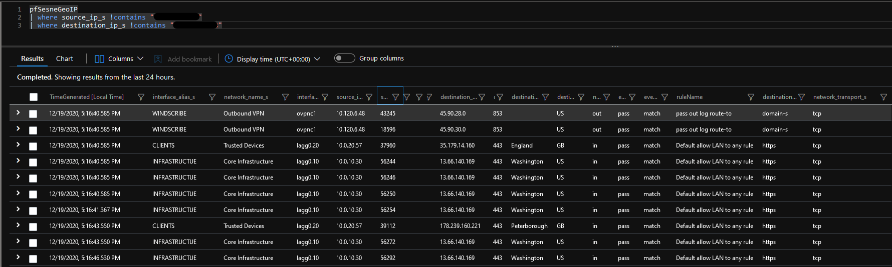

# pfSense/OPNsense syslog to Azure Sentinel

This project brings in syslog messages from pfSense or OPNsense, parses them using Logstash GROK, adds additional context to the log messages and then sends them to Azure Sentinel.

As there is no out-of-the-box Azure Sentinel connector for either pfSense or OPNsense this project fills that void and allows you full control over your logs. 

## Configuration

For Deployments please use the [Logstash Guide](Logstash-Configuration/README.md)

This project exposes the following pfSense/OPNsense data points to Azure Sentinel:

 

|Data points in Azure Sentinel| | | | | |
|---|---|---|---|---|---|
|_timestamp_t|_version_s|destination_as_ip_s|destination_as_number_d|destination_as_organization_name_s
|destination_geo_city_name_s|destination_geo_continent_code_s|destination_geo_country_code3_s|destination_geo_country_iso_code_s|destination_geo_country_name_s
|destination_geo_dma_code_d|destination_geo_ip_s|destination_geo_latitude_d|destination_geo_location_lat_d|destination_geo_location_lon_d
|destination_geo_longitude_d|destination_geo_postal_code_s|destination_geo_region_iso_code_s|destination_geo_region_name_s|destination_geo_timezone_s
|destination_ip_s|destination_port_s|destination_service_sdhcp_operation_s|dhcpd_release_s|dhcpv4_client_ip_s
|dhcpv4_client_mac_s|dhcpv4_option_hostname_s|dhcpv4_server_ip_s|ecs_version_s|event_action_s
|event_created_t|event_reason_s|Flags_s|icmp_type_s|interface_alias_s
|interface_name_s|log_original_s|log_syslog_priority_s|network_direction_s|network_iana_number_s
|network_name_s|network_packets_s|network_transport_s|network_type_s|observer_ip_s
|observer_name_s|observer_product_s|observer_serial_number_s|observer_type_s|option_s
|pf_app_s|pf_icmp_echo_id_s|pf_icmp_echo_sequence_s|pf_icmp_unreachport_destination_ip_s|pf_icmp_unreachport_port_s
|pf_icmp_unreachport_protocol_s|pf_ipv4_ecn_s|pf_ipv4_flags_s|pf_ipv4_offset_s|pf_ipv4_packet_id_s
|pf_ipv4_tos_s|pf_ipv4_ttl_s|pf_ipv6_class_s|pf_ipv6_flow_label_s|pf_ipv6_hop_limit_s
|pf_packet_length_s|pf_protocol_id_s|pf_protocol_type_s|pf_tcp_ack_number_s|pf_tcp_flags_s
|pf_tcp_options_s|pf_tcp_sequence_number_s|pf_tcp_window_s|pf_transport_data_length_s|priority_s
|process_name_s|process_pid_s|rule_alias_s|rule_classification_s|rule_description_s
|rule_reference_s|rule_ruleset_s|rule_uuid_s|rule_version_s|source_as_ip_s
|source_as_number_d|source_as_organization_name_s|source_geo_city_name_s|source_geo_continent_code_s|source_geo_country_code3_s
|source_geo_country_iso_code_s|source_geo_country_name_s|source_geo_dma_code_d|source_geo_ip_s|source_geo_latitude_d
|source_geo_location_lat_d|source_geo_location_lon_d|source_geo_longitude_d|source_geo_postal_code_s|source_geo_region_iso_code_s
|source_geo_region_name_s|source_geo_timezone_s|source_ip_s|source_port_s|source_service_s
|tags_s|pf|GeoIP_Source|GeoIP_Destination|vpn_log_message_s

 

## KQL

Using the Azure Sentinel [KQL](KQL/pfSense/) we can break down this data into readable formats

## Linux Performance Monitoring

Optionally you can also install the [Linux OMS Agent](Linux-OMS-Agent/README.md) to collect performance stats from the Logstash log collector. This is useful for creating analytics rules that will monitor for disk space alerts and excessive CPU usage.

## Credits

This project is only possible with the work carried out by [a3ilson](https://github.com/pfelk/pfelk) and his pfELK project to parse the pfSense log files.
